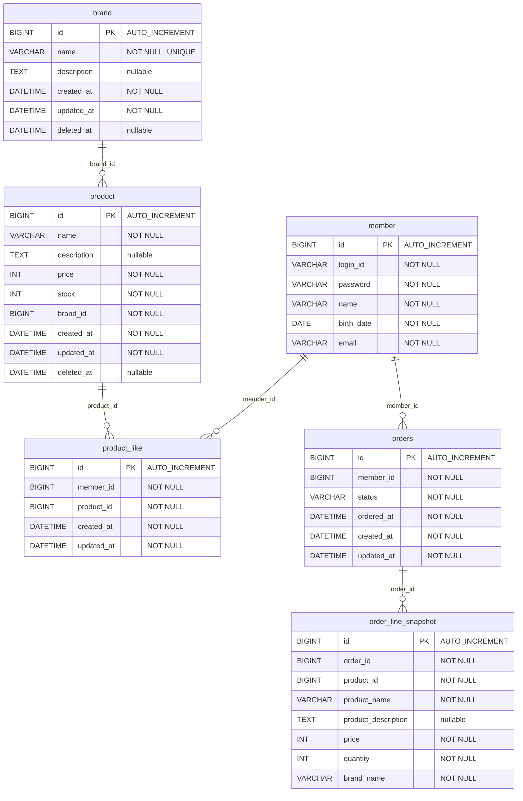

# ERD (Entity-Relationship Diagram)

> 작성일: 2026-02-12
> 기능 정의서(01), 시퀀스 다이어그램(02), 클래스 다이어그램(03) 기반
> FK 제약조건 없음 — 모든 참조 무결성은 애플리케이션 레벨에서 관리

---

## 1. ERD 다이어그램

> **관계선 = 논리 참조**. DB에 FK 제약조건은 존재하지 않는다. 참조 무결성은 애플리케이션 레벨에서 보장한다.

---

## 2. 읽는 포인트

### FK 없음 — 앱 레벨 참조 무결성

모든 테이블 간 참조는 `BIGINT` 컬럼(brand_id, member_id 등)으로만 연결된다. DB에 FOREIGN KEY 제약조건을 걸지 않는다.

- **이유**: BC(Bounded Context) 간 결합도를 최소화한다. MSA 전환 시 테이블이 별도 DB로 분리되어도 구조 변경이 불필요하다.
- **대신**: 참조 대상이 존재하는지, 삭제되지 않았는지는 Service/Facade 레벨에서 검증한다 (시퀀스 다이어그램 참고).

### VO → 컬럼 매핑

클래스 다이어그램의 VO(Value Object)는 별도 테이블이 아닌 **엔티티 테이블의 컬럼**으로 매핑된다.

| VO | 매핑 컬럼 | DB 타입 | 규칙 (앱 레벨) |
|----|----------|---------|--------------|
| Stock | product.stock | INT | >= 0 (음수 불가) |
| Price | product.price, order_line_snapshot.price | INT | > 0 (양수만) |
| Quantity | order_line_snapshot.quantity | INT | > 0 (양수만) |

> VO는 코드 구조이지 DB 구조가 아니다 (클래스 다이어그램 안티패턴 #3).
> DB에는 INT 컬럼으로 저장되고, 앱에서 VO 객체로 감싸서 규칙을 검증한다.

### 상속 전략 (MappedSuperclass)

JPA 상속은 `@MappedSuperclass`를 사용한다. 상속 클래스별로 별도 테이블이 생기지 않고, 자식 테이블에 컬럼이 포함된다.

| 상속 클래스 | 포함 컬럼 | 상속하는 테이블 |
|------------|----------|---------------|
| BaseEntity | id, created_at, updated_at, **deleted_at** | brand, product |
| BaseTimeEntity (신규) | id, created_at, updated_at | product_like, orders |

### 삭제 정책별 테이블 구분

| 삭제 정책 | 테이블 | deleted_at 유무 | 상속 |
|----------|--------|----------------|------|
| soft-delete | brand, product | 있음 | BaseEntity |
| hard-delete | product_like | 없음 | BaseTimeEntity |
| 삭제 없음 | orders, order_line_snapshot | 없음 | BaseTimeEntity / 없음 |

---

## 3. 테이블 상세 정의

### member (기존)

독립 엔티티. BaseEntity를 상속하지 않는다.

| 컬럼 | 타입 | 제약 | 비고 |
|-------|------|------|------|
| id | BIGINT | PK, AUTO_INCREMENT | |
| login_id | VARCHAR | NOT NULL | |
| password | VARCHAR | NOT NULL | 암호화 저장 |
| name | VARCHAR | NOT NULL | 2-40자, 한글/영문 |
| birth_date | DATE | NOT NULL | 미래 날짜 불가 |
| email | VARCHAR | NOT NULL | RFC 5321, 최대 255자 |

### brand

BaseEntity 상속 (soft-delete).

| 컬럼 | 타입 | 제약 | 비고 |
|-------|------|------|------|
| id | BIGINT | PK, AUTO_INCREMENT | |
| name | VARCHAR | NOT NULL, UNIQUE | delete 시 이름 변경으로 UNIQUE 해소 |
| description | TEXT | nullable | 선택 입력 |
| created_at | DATETIME | NOT NULL | BaseEntity |
| updated_at | DATETIME | NOT NULL | BaseEntity |
| deleted_at | DATETIME | nullable | soft-delete 마커 |

**UNIQUE 해소 전략**: Brand.delete() 시 name을 변경하여(예: `_DELETED_{timestamp}` 접미) UNIQUE 제약을 해소한다. 삭제된 브랜드 이름을 새 브랜드가 재사용할 수 있다.

### product

BaseEntity 상속 (soft-delete).

| 컬럼 | 타입 | 제약 | 비고 |
|-------|------|------|------|
| id | BIGINT | PK, AUTO_INCREMENT | |
| name | VARCHAR | NOT NULL | |
| description | TEXT | nullable | 선택 입력 |
| price | INT | NOT NULL | VO: Price → 앱 레벨 > 0 검증 |
| stock | INT | NOT NULL | VO: Stock → 앱 레벨 >= 0 검증 |
| brand_id | BIGINT | NOT NULL | → brand.id (FK 없음) |
| created_at | DATETIME | NOT NULL | BaseEntity |
| updated_at | DATETIME | NOT NULL | BaseEntity |
| deleted_at | DATETIME | nullable | soft-delete 마커 |

### product_like

BaseTimeEntity 상속 (hard-delete).

| 컬럼 | 타입 | 제약 | 비고 |
|-------|------|------|------|
| id | BIGINT | PK, AUTO_INCREMENT | |
| member_id | BIGINT | NOT NULL | → member.id (FK 없음) |
| product_id | BIGINT | NOT NULL | → product.id (FK 없음) |
| created_at | DATETIME | NOT NULL | BaseTimeEntity |
| updated_at | DATETIME | NOT NULL | BaseTimeEntity |

- **UNIQUE(member_id, product_id)**: 같은 회원이 같은 상품에 중복 좋아요를 할 수 없다.

### orders

BaseTimeEntity 상속 (삭제 없음). 테이블명은 `orders` (ORDER는 SQL 예약어).

| 컬럼 | 타입 | 제약 | 비고 |
|-------|------|------|------|
| id | BIGINT | PK, AUTO_INCREMENT | |
| member_id | BIGINT | NOT NULL | → member.id (FK 없음) |
| status | VARCHAR | NOT NULL | ACCEPTED / REJECTED |
| ordered_at | DATETIME | NOT NULL | 주문 시점 |
| created_at | DATETIME | NOT NULL | BaseTimeEntity |
| updated_at | DATETIME | NOT NULL | BaseTimeEntity |

- **status**: 주문 생성 시 즉시 최종 상태(ACCEPTED/REJECTED)로 결정된다. 중간 상태 없음.

### order_line_snapshot

Order에 종속되는 VO. Composition 1:N.

| 컬럼 | 타입 | 제약 | 비고 |
|-------|------|------|------|
| id | BIGINT | PK, AUTO_INCREMENT | JPA 매핑용 |
| order_id | BIGINT | NOT NULL | → orders.id (FK 없음) |
| product_id | BIGINT | NOT NULL | 스냅샷 시점 상품 ID |
| product_name | VARCHAR | NOT NULL | 스냅샷 |
| product_description | TEXT | nullable | 스냅샷 |
| price | INT | NOT NULL | VO: Price (주문 시점 가격) |
| quantity | INT | NOT NULL | VO: Quantity (주문 수량) |
| brand_name | VARCHAR | NOT NULL | 스냅샷 시점 브랜드명 |

- **timestamp 없음**: 불변 VO. 생성 시점은 소속 Order의 created_at/ordered_at이 대변한다.
- **id 컬럼 존재 이유**: 도메인에서는 VO(독립 식별 불필요)이지만, JPA 1:N 매핑에 PK가 필요하다.
- **상품/브랜드 삭제 무관**: 스냅샷이므로 원본이 삭제되어도 기록은 유지된다.

---

## 4. 설계 결정 기록

| # | 결정 | 이유 | 대안 |
|---|------|------|------|
| 1 | FK 제약조건 없음 | 앱 레벨에서 참조 무결성 관리. BC 간 결합도 최소화. MSA 전환 대비 | FK 설정 (DB 정합성 보장이 강하나, BC 간 결합 증가) |
| 2 | VO는 컬럼으로 매핑 | VO는 코드 구조이지 DB 구조가 아니다. 별도 테이블은 안티패턴 | VO별 테이블 (과도한 JOIN, 도메인 의미 왜곡) |
| 3 | order → orders 테이블명 | ORDER는 SQL 예약어. 백틱 의존보다 명확한 이름 사용 | 백틱으로 감싸기 (DB 종류 변경 시 호환성 문제) |
| 4 | OrderLineSnapshot에 id 컬럼 포함 | 도메인 VO이지만 JPA @OneToMany 매핑에 PK 필요 | @ElementCollection (컬렉션 전체 삭제/재삽입 성능 이슈) |
| 5 | OrderLineSnapshot에 timestamp 없음 | 불변 VO. Order의 created_at이 생성 시점을 대변 | timestamp 포함 (불필요한 중복 정보) |
| 6 | product_like에 UNIQUE(member_id, product_id) | 중복 좋아요 방지를 DB 레벨에서 보장. 앱 레벨 검증만으로는 동시성 이슈 가능 | 앱 레벨만 (경쟁 조건에 취약) |
| 7 | brand.name에 UNIQUE 제약 | 이름 중복 불가 요구사항. delete 시 이름 변경으로 UNIQUE 해소 (클래스 다이어그램 결정 #3) | UNIQUE 없이 앱 검증만 (동시성에 취약) |
