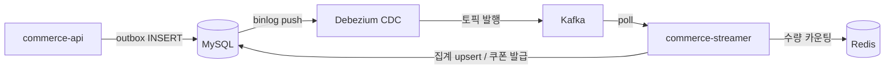
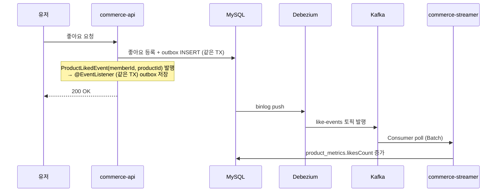
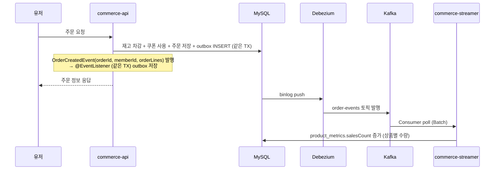
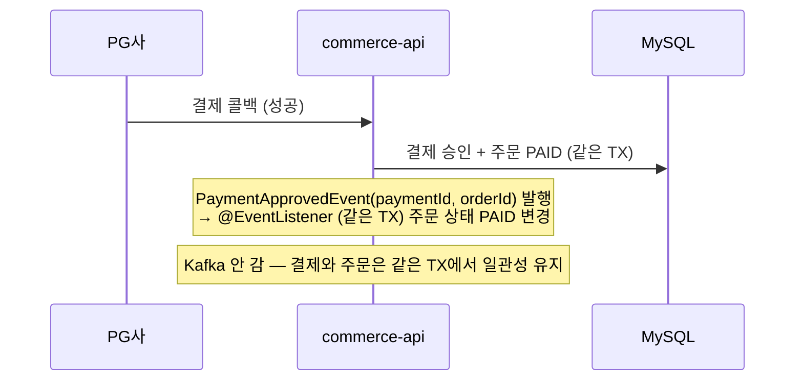
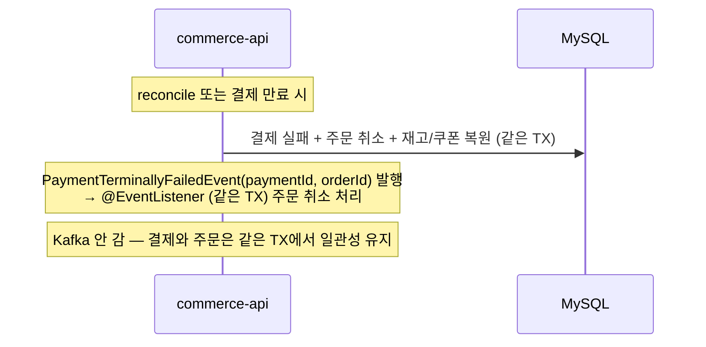
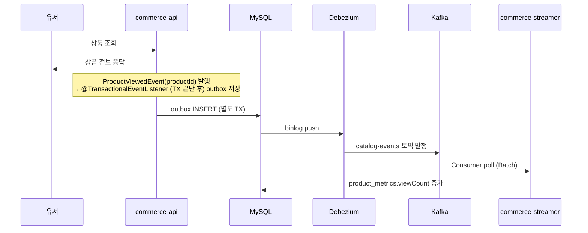
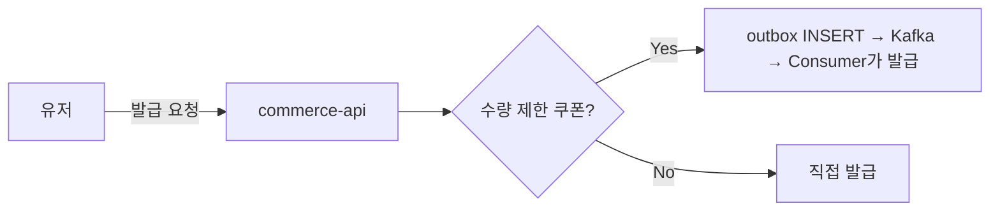
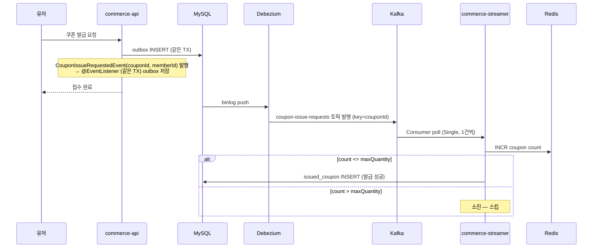
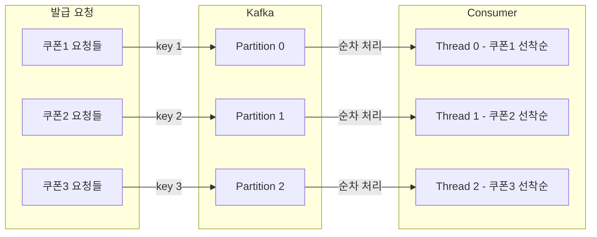
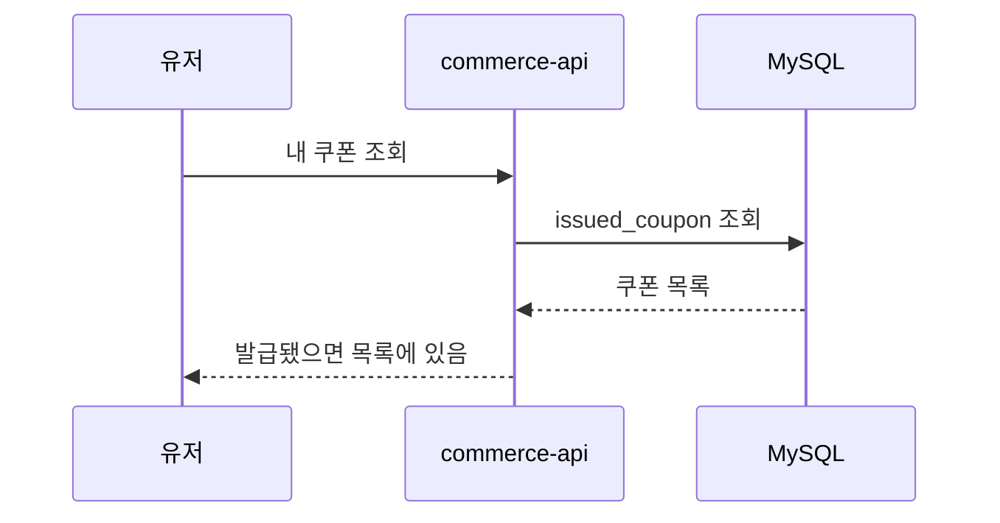

# Round 07 — 이벤트 기반 아키텍처 전체 흐름

---

## 전체 인프라 구성

---

## 좋아요

---

## 주문 생성

---

## 결제 승인

---

## 결제 최종 실패

---

## 상품 조회

---

## 선착순 쿠폰 발급

### 발급 분기

### 선착순 발급 흐름

### 파티션 + 순서 보장

### 결과 확인 (Polling)

---

## 이벤트 요약

| 기능 | 이벤트 | TX 방식 | Kafka | Consumer 처리 |
|---|---|---|---|---|
| 좋아요 | ProductLikedEvent | 같은 TX | like-events | likesCount 집계 |
| 좋아요 취소 | ProductUnlikedEvent | 같은 TX | like-events | likesCount 집계 |
| 주문 생성 | OrderCreatedEvent | 같은 TX | order-events | salesCount 집계 |
| 주문 취소 | OrderCancelledEvent | 같은 TX | order-events | — |
| 결제 승인 | PaymentApprovedEvent | 같은 TX | 안 감 | 주문 PAID 직접 변경 |
| 결제 최종 실패 | PaymentTerminallyFailedEvent | 같은 TX | 안 감 | 주문 취소 직접 처리 |
| 상품 조회 | ProductViewedEvent | TX 끝난 후 | catalog-events | viewCount 집계 |
| 선착순 쿠폰 | CouponIssueRequestedEvent | 같은 TX | coupon-issue-requests | Redis INCR + 쿠폰 발급 |
