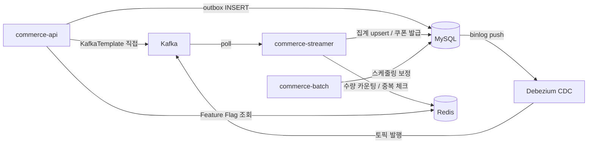

# Round 07: 이벤트 기반 아키텍처 + 선착순 쿠폰 발급

## 📌 Summary

- **배경**: 기능 확장으로 여러 도메인이 하나의 TX에 묶이기 시작했고, 부가 로직(집계, 로깅)이 핵심 로직의 성공/실패에 영향을 주고 있었습니다. 선착순 쿠폰(100장, 1만 명)은 DB 직접 접근으로는 커넥션 풀 고갈이 예상됐습니다.
- **목표**: ApplicationEvent로 관심사를 분리하고, Kafka 파이프라인으로 시스템 간 전파를 구축하고, 선착순 쿠폰을 Kafka + Redis로 처리합니다.
- **결과**: 16개 통합 테스트 전부 PASS. k6 1000건 부하 테스트에서 100장 한정 쿠폰 **정확히 100장 발급**, 초과 0건, 에러율 0%.

---

## 🧭 Context & Decision

### 1. 이벤트 분리 기준 — 무조건 이벤트로 나누는 게 아니다

"이걸 이벤트로 분리해야 하는가?"를 판단하는 기준을 세웠습니다.

```
분리했을 때 일시적 불일치가 비즈니스 리스크를 만드는가?
├── Yes → 같은 TX 유지
└── No → 분리 가능
```

예를 들어 결제 승인 → 주문 PAID 변경은 같은 TX여야 합니다. AFTER_COMMIT으로 분리하면 결제는 APPROVED인데 주문이 ACCEPTED에 머무를 수 있고, reconcile도 이미 APPROVED라 스킵해서 safety net이 안 됩니다.

반면 좋아요 → likesCount 집계는 분리해도 됩니다. 집계가 어긋나도 스케줄링으로 보정 가능하니까요.

### 2. Outbox vs KafkaTemplate — 전부 Outbox가 아니다

처음에는 모든 이벤트를 Outbox + CDC(Debezium)로 Kafka에 보냈습니다. 하지만 좋아요/조회수는 Outbox 쓰기 비용이 높고, 유실돼도 비즈니스 리스크가 낮았습니다.

| 이벤트 | 방식 | 이유 |
|---|---|---|
| 주문 판매량 | Outbox + CDC | 주문 데이터와 같은 TX 보장 필요 |
| 선착순 쿠폰 | Outbox + CDC | 발급 요청 유실 방지 |
| 좋아요/조회수 | KafkaTemplate 직접 | 유실돼도 스케줄링 보정, Outbox 쓰기 비용 절약 |
| 결제→주문 | Kafka 안 탐 | 같은 TX 필수 (위 1번 참조) |

KafkaTemplate을 쓰면 commerce-api에 Kafka 의존이 추가되지만, 서비스(application 레이어)는 ApplicationEvent만 발행하고 KafkaTemplate은 presentation 레이어의 리스너에서만 사용하므로 레이어 경계는 유지됩니다.

### 3. @EventListener vs BEFORE_COMMIT vs AFTER_COMMIT — 셋 다 다르다

| 방식 | 실행 시점 | TX | 용도 |
|---|---|---|---|
| @EventListener | publishEvent() 즉시 | 같은 TX | 결제→주문 (cancel 안에서 이벤트 재발행 가능) |
| BEFORE_COMMIT | 커밋 직전 | 같은 TX | Outbox 저장 (비즈니스 로직 안 끊음) |
| AFTER_COMMIT | 커밋 후 | 별도 TX | KafkaTemplate 발행 (TX 안 길어짐) |

처음에는 Outbox 리스너에 `@EventListener`를 썼는데, `BEFORE_COMMIT`이 의도("커밋 전에 같이 저장")를 더 명확하게 표현해서 변경했습니다. 단, `OrderPaymentEventListener`는 `cancel()` 안에서 `OrderCancelledEvent`를 다시 발행하므로 BEFORE_COMMIT에서 이벤트 중첩 위험이 있어 `@EventListener`를 유지했습니다.

AFTER_COMMIT에서 DB 작업이 필요하면 `@Transactional(REQUIRES_NEW)`가 필수입니다. 기존 TX가 이미 끝났으니까요. 하지만 KafkaTemplate.send()는 네트워크 전송이라 `@Transactional` 없이 동작합니다.

### 4. 선착순 쿠폰 — 왜 Kafka인가

비관적 락은 1만 명이 같은 row에 줄 서서 느리고, 낙관적 락은 하나 성공 나머지 실패로 retry 폭주하고, 전부 INSERT 후 처리는 커넥션 풀이 고갈됩니다.

Kafka를 DB 앞에 두면:
- API는 "접수 완료" 즉시 응답 (DB 안 건드림)
- Kafka가 요청을 직렬화 (줄 세우기)
- Consumer가 통제된 속도로 1건씩 처리

수량 제한은 Redis INCR로 O(1), 중복 발급 방지는 Redis SADD로 사용자 단위 체크. DB INSERT 실패 시 SREM + DECR로 보상 롤백합니다.

파티션은 key=couponId로 설정해서, 같은 쿠폰의 요청은 같은 파티션 → 선착순 보장. 서로 다른 쿠폰은 다른 파티션 → 병렬 처리.

### 5. Consumer 설계 — Batch vs Single, 그리고 프록시 이슈

집계(좋아요/판매량/조회수)는 하나 빠져도 큰 문제 없으니 Batch Listener, 쿠폰 발급은 한 건이 중요하니 Single Listener를 선택했습니다. Single이면 실패 시 Ack를 안 해서 Kafka가 같은 메시지를 재전달합니다.

Consumer와 Processor를 같은 클래스에 두면 `@Transactional`이 안 먹습니다. Spring AOP가 프록시 기반이라 같은 클래스 내부 호출은 프록시를 우회하기 때문입니다. 그래서 Consumer(Kafka 소비 + Ack)와 Processor(DB 트랜잭션)를 별도 빈으로 분리했습니다.

### 6. Graceful Degradation — 선착순 이벤트 시 비핵심 기능 끄기

Redis Feature Flag로 집계 Kafka 발행을 on/off할 수 있게 했습니다. 선착순 이벤트 시 좋아요/조회수 집계를 끄면 리소스를 쿠폰 발급에 집중할 수 있고, 꺼진 동안 빠진 집계는 자정 스케줄러가 보정합니다.

```
이벤트 시작 전: PUT /api-admin/v1/features/metrics:like?enabled=false
이벤트 끝난 후: PUT /api-admin/v1/features/metrics:like?enabled=true
```

---

## 🏗️ Design Overview

### 전체 인프라



### 이벤트 파이프라인

| 기능 | 이벤트 | 발행 방식 | Kafka 토픽 | Consumer |
|---|---|---|---|---|
| 좋아요 | ProductLikedEvent | AFTER_COMMIT → KafkaTemplate | product-like-events | Batch → likesCount |
| 조회수 | ProductViewedEvent | AFTER_COMMIT → KafkaTemplate | product-view-events | Batch → viewCount |
| 판매량 | OrderCreatedEvent | BEFORE_COMMIT → Outbox → CDC | order-events | Batch → salesCount |
| 선착순 쿠폰 | CouponIssueRequestedEvent | BEFORE_COMMIT → Outbox → CDC | coupon-issue-request-events | Single → Redis SADD/INCR + 발급 |
| 결제 승인 | PaymentApprovedEvent | @EventListener (같은 TX) | Kafka 안 탐 | order.pay() |
| 결제 실패 | PaymentTerminallyFailedEvent | @EventListener (같은 TX) | Kafka 안 탐 | orderService.cancel() |

### 이벤트 설계 원칙

모든 도메인 이벤트에 **대상, 행위, 정보, 시간**을 포함했습니다.

| 요소 | 설명 | 예시 |
|---|---|---|
| 대상 | 주체가 누구인가 | productId |
| 행위 | 무엇을 했는가 | Liked (과거분사) |
| 정보 | 행위 시 갖고 있던 정보 | memberId |
| 시간 | 언제 일어났는가 | occurredAt |

---

## 📊 테스트 결과

### 통합 테스트 — 16건 전부 통과

| 카테고리 | 수 | 검증 내용 |
|---|---|---|
| 이벤트 TX 보장 | 6 | outbox 실패 → 좋아요 롤백, 결제 → 주문 PAID (SpyBean) |
| Consumer 멱등 처리 | 5 | 중복 eventId 스킵, 경계값(0에서 UNLIKE), 자동 생성 |
| 선착순 쿠폰 동시성 | 3 | 100장 한정 200요청 → 정확히 100장, 만료 쿠폰 거절 |
| 결제→주문 이벤트 | 2 | 같은 TX에서 PAID/APPROVED 상태 변경 |

### k6 부하 테스트 — 전체 파이프라인 (API → Outbox → CDC → Kafka → Consumer)

| 항목 | 200건 | 1000건 |
|---|---|---|
| API 성공률 | 100% | 100% |
| p95 응답시간 | 1.78초 | 1.78초 |
| **쿠폰 발급** | **100장** | **100장** |
| 소진 처리 | 99건 | 900건 |
| 초과 발급 | 0건 | 0건 |
| 멱등 처리 | 100% | 100% |
| Redis INCR 최종값 | 199 | 1000 |

---

## 🔁 리팩토링

구현 후 테스트하면서 발견한 문제와 개선을 반복했습니다.

| 변경 | Before | After | 이유 |
|---|---|---|---|
| Outbox 리스너 | @EventListener | BEFORE_COMMIT | 커밋 직전 실행이 의도에 맞음 |
| 좋아요/조회수 발행 | Outbox → CDC | KafkaTemplate 직접 | 쓰기 비용 높고, 유실돼도 스케줄링 보정 |
| Consumer 역직렬화 | `Map<String, Object>` 직접 캐스팅 | DebeziumMessageParser | Debezium schema+payload 구조 파싱 |
| toJson 중복 | 리스너마다 try-catch 반복 | EventJsonSerializer 공통 유틸 | 3곳 중복 제거 |
| 쿠폰 중복 방지 | event_handled만 (이벤트 단위) | Redis SADD (사용자 단위) | 같은 사람 연타 방지 |
| Redis ↔ DB 불일치 | 없음 | DB 실패 시 SREM + DECR 보상 | INCR 올라갔는데 발급 안 되는 문제 |
| metrics 위치 | commerce-streamer | infrastructure/jpa | JPA 스캔 범위 문제 |
| AFTER_COMMIT + TX | @Transactional | @Transactional(REQUIRES_NEW) | 기존 TX 끝난 시점이라 새 TX 필요 |

---

## ✅ Checklist

### 🧾 Step 1 — ApplicationEvent
- [x] 주문–결제 플로우에서 부가 로직을 이벤트 기반으로 분리한다
- [x] 좋아요 처리와 집계를 이벤트 기반으로 분리한다 (집계 실패와 무관하게 좋아요는 성공)
- [x] 유저 행동(조회, 좋아요, 주문 등)에 대한 서버 레벨 로깅을 이벤트로 처리한다
- [x] 동작의 주체를 적절하게 분리하고, 트랜잭션 간의 연관관계를 고민했습니다

### 🎾 Step 2 — Kafka Producer / Consumer
- [x] ApplicationEvent 중 시스템 간 전파가 필요한 이벤트를 Kafka로 발행한다
- [x] Transactional Outbox Pattern 구현 (주문, 쿠폰)
- [x] PartitionKey 기반 이벤트 순서 보장 (key=couponId, key=productId)
- [x] Consumer가 Metrics 집계 처리 (product_metrics upsert)
- [x] event_handled 테이블을 통한 멱등 처리 구현
- [x] manual Ack 처리

### 🎫 Step 3 — 선착순 쿠폰 발급
- [x] 쿠폰 발급 요청 API → Kafka 발행 (비동기 처리)
- [x] Consumer에서 선착순 수량 제한 + 중복 발급 방지 구현
- [x] 발급 완료/실패 결과를 유저가 확인할 수 있는 구조 설계 (Polling — 기존 내 쿠폰 조회 API)
- [x] 동시성 테스트 — 수량 초과 발급이 발생하지 않는지 검증 (200건, 1000건 전부 정확히 100장)

---

## 💬 Review Points

### 1. Outbox vs KafkaTemplate — 어디서 선을 그어야 하는가

주문 판매량은 Outbox(유실 방지), 좋아요/조회수는 KafkaTemplate 직접(유실 감수 + 스케줄링 보정)으로 나눴습니다. "유실돼도 괜찮은가"가 기준이었는데, 실무에서는 이 경계를 어떤 기준으로 나누시는지 궁금합니다.

### 2. Redis INCR + DB INSERT 불일치 — 보상 롤백이 충분한가

DB INSERT 실패 시 Redis SREM + DECR로 롤백하고 있지만, 이 롤백 자체가 실패할 수 있습니다. 현재 Kafka Single Listener가 순차 처리하므로 동시성 문제는 적지만, Redis 없이 DB COUNT만으로 카운팅해도 되는 구조입니다. Redis를 유지하는 게 맞는지, 아니면 순차 처리 환경에서는 오버엔지니어링인지 의견이 궁금합니다.

### 3. @EventListener의 실효성 — 리스너가 하나뿐이면 직접 호출이 낫지 않은가

결제→주문 상태 변경은 현재 `@EventListener`로 분리돼 있지만, 리스너가 하나뿐입니다. 직접 호출이 더 명확할 수 있으나, 결제 승인/실패는 나중에 알림, 로깅 등 리스너가 추가될 가능성이 높다고 판단해 이벤트를 유지했습니다. 이런 "미래 확장 가능성"을 근거로 이벤트를 유지하는 판단이 적절한지 궁금합니다.
